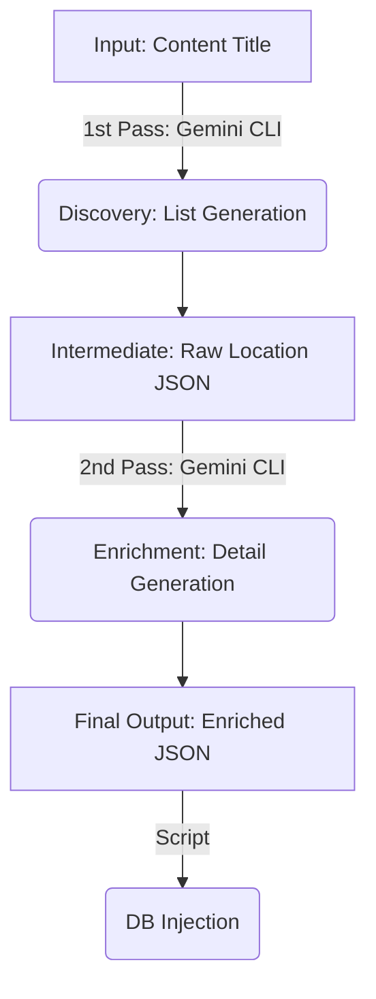

# AI Content & Location Automation Plan (Gemini CLI Based)

This document defines the workflow to automate the census-level discovery and registration of locations (filming sites, restaurants, cafes) for OTT content using AI agents (Gemini CLI).

## 🎯 Objective
To secure a list of **all locations** related to specific content (e.g., "Culinary Class Wars", "K-Pop Demon Hunters") and automatically populate **detailed page data (KR/EN descriptions, coordinates, metadata)** without manual entry.

## 🛠 Tech Stack
- **Core AI**: **Gemini CLI** - Text generation, reasoning, translation.
- **Location**: **Google Maps Geocoding API** - Converts addresses to precise latitude/longitude coordinates.
- **Scripting**: Node.js or Python - For invoking Gemini CLI and processing JSON data.
- **Target**: Admin API or DB Seed Script.

---

## 🔄 Workflow: Two-Pass Gemini CLI Strategy

The automation pipeline consists of **running the Gemini CLI twice** to ensure high-quality data.

1.  **1st Pass (Census)**: "List all locations in this show" -> **Get Raw List**
2.  **2nd Pass (Enrichment)**: "Generate details for this specific location" -> **Complete Data**



---

## Phase 1: Content Discovery (The Census)

**Goal**: Identify *every* significant real-world location associated with the content.

### 1. Input
- **Content Name**: (e.g., "Culinary Class Wars")
- **Keywords**: (e.g., "Contestant Restaurants", "Filming Locations", "Chef Businesses")

### 2. Gemini CLI Strategy (Discovery)
- **Prompt Strategy**: Use high Temperature (0.7) for creative and comprehensive listing.
- **Example Command**:
  ```bash
  # Example 1: Culinary Class Wars
  gemini prompt "List the names of all real-world restaurants operated by chefs participating in 'Culinary Class Wars'. Output in JSON list format."

  # Example 2: K-Pop Demon Hunters
  gemini prompt "List all key filming locations (restaurants, cafes, landmarks) featured in 'K-Pop Demon Hunters'. Focus on real-world places that can be visited. Output in JSON list format."
  ```
- **Search Augmentation (RAG/Grounding)**: Inject search results (blogs, community wikis) into the prompt context for the latest information.

### 3. Intermediate Output (JSON)
```json
[
    { "name": "Via Toledo Pasta Bar", "type": "Restaurant", "context": "Run by Napoli Matfia" },
    { "name": "Trid", "type": "Restaurant", "context": "Run by Triple Star" },
    { "name": "Deepin", "type": "Bar", "context": "Run by Cooking Maniac" }
]
```

---

## Phase 2: Detail Enrichment (The Researcher)

**Goal**: Generate detailed schema data required for the app service for each identified location.

### 1. Gemini CLI Strategy (Enrichment)
Loop through each location name and request details from Gemini.

- **Prompt**:
  > Generate detailed information for "{LocationName}" in JSON format.
  > 1. Korean Description (description): ~300 chars, attractive intro.
  > 2. English Description (descriptionEn): Natural translation of the above.
  > 3. Coordinates (latitude, longitude): Approximate (Geolocation API recommended for precision).
  > 4. Metadata: Opening hours, parking, etc.
  > 5. Chef's Pick: If it's a restaurant, generate a persona-based 'Owner's Word'.

### 2. Final Output Format (JSON)
Matches the `CreateLocationRequest` DTO structure.

```json
{
    "name": "Via Toledo Pasta Bar",
    "nameEn": "Via Toledo Pasta Bar",
    "address": "7-2, Wonhyo-ro 83-gil, Yongsan-gu, Seoul",
    "addressEn": "7-2, Wonhyo-ro 83-gil, Yongsan-gu, Seoul",
    "description": "An authentic Neapolitan pasta bar run by Chef Kwon Sung-jun. Known for its fresh pasta that reproduces the taste of local Italy.",
    "descriptionEn": "An authentic Neapolitan pasta bar run by Chef Kwon Sung-jun. Known for its fresh pasta that reproduces the taste of local Italy.",
    "latitude": 37.536123,
    "longitude": 126.967456,
    "thumbnailUrl": "(Image URL)",
    "isChef": true,
    "ownerDescription": "Experience the most authentic taste of Italy in Seoul.",
    "ownerDescriptionEn": "Experience the most authentic taste of Italy in Seoul.",
    "hasVisitorInfo": true,
    "openingHours": "17:00 - 22:00",
    "parking": "No Parking"
}
```

#### 2-1. Variant: Non-Restaurant (e.g., Filming Site, Park)
If the location is not a restaurant, set `isChef` to `false` and omit the owner description.

```json
{
    "name": "Gyeongbokgung Palace",
    "nameEn": "Gyeongbokgung Palace",
    "address": "161, Sajik-ro, Jongno-gu, Seoul",
    "addressEn": "161, Sajik-ro, Jongno-gu, Seoul",
    "description": "The main royal palace of the Joseon dynasty, representing the beauty of Korea.",
    "descriptionEn": "10화에서 팀전 미션이 펼쳐진 장소입니다.",
    "latitude": 37.579617,
    "longitude": 126.977041,
    "thumbnailUrl": "(Image URL)",
    "isChef": false,
    "ownerDescription": null,
    "ownerDescriptionEn": null,
    "onScreen": "The location where the team mission took place in Episode 10.",
    "onScreenEn": "10화에서 팀전 미션이 펼쳐진 장소입니다.",
    "hasVisitorInfo": true,
    "openingHours": "09:00 - 18:00",
    "parking": "Available"
}
```

---

## Phase 3: Integration & Execution

**Goal**: Reflect collected data into the actual service DB.

### 1. Web Admin Integration
Integrate execution directly into the Admin UI via button clicks.

#### Workflow
1.  **AI Location Finder (Census)**:
    *   **UI Refactor**: Move the "Location Name Input & Find" interface to the **'New Page Registration' entry screen (LocationSelection)**.
    *   Click "Find with AI" -> Backend executes Gemini CLI (1st Pass).
    *   Display the returned list of locations.
2.  **Detail Auto-fill (Enrichment) & Draft (Batch Processing)**:
    *   **Multi-Select**: User selects multiple locations (e.g., 5 items) via **checkboxes** from the list.
    *   **Batch Generation**: Click "Add Detail Page" -> Backend executes **2nd Pass for all selected items** creating Drafts.
    *   **List Management**: Converted locations are **automatically removed from the 'Found List'** or marked as 'Done' to prevent duplicates.
    *   **Anti-Hallucination**: Since users explicitly **select** valid items before generation, it acts as a primary filter against AI hallucinations.
3.  **Review & Save (Human-in-the-loop)**:
    *   Human opens the draft.
    *   **Manually uploads the image** and reviews the text.
    *   Click "Save" -> Persists to DB as `isActive: true`.

### 2. Automation Script (Seed Generator)
Create a script that reads the JSON files from Phase 2 and generates a `seed.ts` file or calls the Admin API directly.

```typescript
// seed-locations.ts example
const locations = require('./generated_locations.json');
for (const loc of locations) {
  await prisma.location.create({ data: loc });
}
```

### 2. Validation
Since AI-generated data (especially coordinates or hours) can hallucinate, it is recommended to upload them with `isActive: false` status via the Admin panel and have a human **"Review"** step.

---

## 🚀 Deployment & Execution Environment

1.  **Server Compatibility**: Fully compatible with deployment servers (Linux/Ubuntu, Docker) via terminal commands.
2.  **Authentication**: To utilize your **Paid User Account**, use the **User Login (OAuth)** method.
    - **Command**: `gcloud auth application-default login --no-browser`
    - **Method**: Copy the URL generated in the server terminal to your local browser, log in, and paste the verification code back into the server terminal.
3.  **CI/CD Integration**: Can be integrated into pipelines (Github Actions, Jenkins) to trigger updates automatically.

---

## ✅ Feasibility & Suggestions

1.  **Feasibility**: **High.** LLMs like Gemini are excellent at extracting structured data (JSON) from unstructured text (reviews, articles).
2.  **Notes**:
    - **Recency**: For very new shows, the model might not know them. Injecting text from 3-5 blog posts into the prompt dramatically improves accuracy.
    - **Images**: Text Gen AI cannot generate valid real-world image URLs. You might need a separate Image Search API or manual addition.
