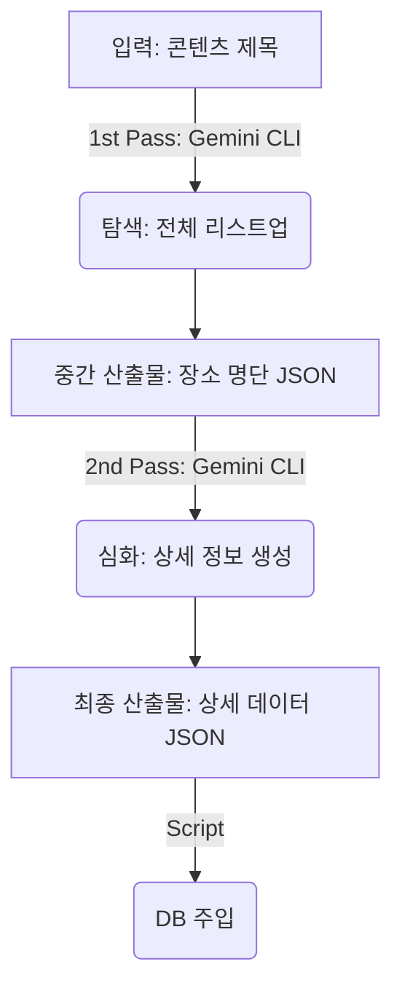

# AI 콘텐츠 및 촬영지 데이터 자동화 플랜 (Gemini CLI 기반)

이 문서는 AI 에이전트(Gemini CLI)를 활용하여 OTT 콘텐츠의 관련된 장소(촬영지, 식당, 카페 등)를 전수 조사하고, 상세 데이터를 자동으로 생성하여 데이터베이스를 구축하는 워크플로우를 정의합니다.

## 🎯 목표
특정 콘텐츠(예: "흑백요리사", "케이팝 데몬 헌터스")와 관련된 **모든 장소 리스트**를 확보하고, 수기 입력 없이 **상세 페이지 데이터(한/영 설명, 좌표, 메타데이터)**를 자동으로 채웁니다.

## 🛠 기술 스택
- **Core AI**: **Gemini CLI** - 텍스트 생성, 추론, 번역 담당
- **Location**: **Google Maps Geocoding API** - 주소를 정확한 위도/경도(좌표)로 변환
- **Scripting**: Node.js 또는 Python - Gemini CLI 호출 및 JSON 데이터 처리
- **Target**: Admin API 또는 DB Seed 스크립트

---

## 🔄 워크플로우: Gemini CLI 2-Pass 전략 (Two-Pass Strategy)

이 자동화 툴은 **Gemini CLI를 총 두 번 실행**하여 데이터를 완성합니다.

1.  **1st Pass (전수 조사)**: "이 콘텐츠에 나온 모든 식당 리스트 줘" -> **리스트 확보**
2.  **2nd Pass (상세 채우기)**: 확보된 각 장소마다 "이 장소의 상세 정보 줘" -> **데이터 완성**



---

## Phase 1: 콘텐츠 탐색 (The Census)

**목표**: 콘텐츠와 관련된 실존하는 중요 장소를 빠짐없이 식별합니다.

### 1. 입력 (Input)
- **콘텐츠명**: (예: "흑백요리사: 요리 계급 전쟁")
- **키워드**: (예: "참가자 식당 리스트", "촬영지", "백종원 방문 맛집")

### 2. Gemini CLI 전략 (탐색 - Census)
- **프롬프트 전략 (Context-Aware Prompting)**:
    - AI에게 **"이 콘텐츠가 서바이벌/경연 프로그램인가?"**를 먼저 판단하거나(또는 입력받거나), 경연 프로그램일 경우 **"참가자들의 실제 운영 업장"**을 찾도록 강력하게 지시해야 합니다.
    - **핵심 요구사항**: "흑백요리사" 같은 프로는 촬영 스튜디오가 아닌, **출연 셰프들의 식당**이 결과로 나와야 합니다.
- **프롬프트 예시 개선**:
  > "Show: '{콘텐츠명}'"
  > "Identify if this is a drama/movie or a survival/competition show."
  > "If it is a **Survival/Competition show** (e.g., Culinary Class Wars, MasterChef): List the **Real-world Restaurants/Cafes OWNED or OPERATED by the participants/chefs**."
  > "   - **CRITICAL**: Include restaurants even if they were NOT filming locations. The connection is the *Participant*."
  > "   - Format: Name: [Restaurant Name], Context: [Chef Name] ([Title/Rank])"
  > "If it is a **Drama/Movie**: List the **actual filming locations**."
  > "Output ONLY in valid JSON list format."

- **검색 증강 (RAG)**: 블로그 ("흑백요리사 식당 리스트") 텍스트를 프롬프트에 제공하는 것이 가장 확실합니다.

### 3. 중간 출력 (JSON) - 예시
단순히 "촬영지"가 아닌 "참가자의 식당"이 명확히 포함되어야 합니다.

```json
[
    {
        "name": "비아 톨레도 파스타바",
        "type": "Restaurant",
        "context": "나폴리 맛피아 (권성준 셰프) 운영 - 우승자"
    },
    {
        "name": "트리드",
        "type": "Restaurant",
        "context": "트리플 스타 (강승원 셰프) 운영"
    },
    {
        "name": "초이닷",
        "type": "Restaurant",
        "context": "최현석 셰프 운영 - 심사위원/참가자"
    },
    {
        "name": "경복궁 평창점",
        "type": "Location",
        "context": "2화 팀전 미션 촬영지"
    }
]
```

---

## Phase 2: 데이터 심화 (The Researcher)

**목표**: 식별된 각 장소에 대해 앱 서비스에 필요한 상세 스키마 데이터를 생성합니다.

### 1. Gemini CLI 전략 (심화)
각 장소 이름에 대해 반복문(Loop)을 돌며 Gemini에게 상세 정보를 요청합니다.

- **프롬프트**:
  > "{장소명}"에 대한 상세 정보를 JSON 포맷으로 생성해.
  > 1. 한글 설명(description): 300자 내외, 매력적인 소개.
  > 2. 영문 설명(descriptionEn): 위 내용을 자연스럽게 번역.
  > 3. 좌표(latitude, longitude): 근사값 (또는 주소를 기반으로 지오코딩 API 활용 권장).
  > 4. 메타데이터: 영업시간 등 추론.
  > 5. **주차 정보 확장 (Advanced Parking)**:
      - 자체 주차장이 없다면, **반경 500m 이내 가장 가까운 공용 주차장**을 찾아줘.
      - 주차장 이름, **장소까지의 도보 거리(예: 300m, 도보 5분)**, 주차장 주소 포함.
      - 미리보기 텍스트: "주차 불가 (도보 5분 거리 '서교 공영주차장' 이용 권장)" 형태로 요약.
  > 6. Chef's Pick: 식당이라면 셰프의 철학이나 대표 메뉴에 대한 가상의 '사장님 한마디' 생성.

### 2. 이미지 자동 수집 (Visual Enhancement)
기존 수동 업로드 방식에서 진화하여, AI Agent가 이미지를 수집하도록 개선합니다.
- **Goal**: 장소당 **약 4장의 고품질 이미지** 자동 확보.
- **전략**:
  - Google Custom Search API (Image) 또는 SerpApi 활용.
  - Gemini가 검색 쿼리 생성 -> 이미지 검색 API 호출 -> 상위 4개 결과(URL) 자동 매핑.
  - **주의**: 저작권 이슈가 없는 이미지나 공식 업체 등록 이미지를 우선하도록 필터링 필요.

### 3. 출력 포맷 (Final JSON)
Admin API의 `CreateLocationRequest` DTO 구조와 일치시킵니다.

```json
{
    "name": "비아 톨레도 파스타바",
    "nameEn": "Via Toledo Pasta Bar",
    "address": "서울 용산구 원효로83길 7-2",
    "addressEn": "7-2, Wonhyo-ro 83-gil, Yongsan-gu, Seoul",
    "description": "권성준 셰프가 운영하는 정통 나폴리 파스타 바입니다...",
    "descriptionEn": "An authentic Neapolitan pasta bar...",
    "latitude": 37.536123,
    "longitude": 126.967456,
    "imageUrls": [
        "https://example.com/img1.jpg",
        "https://example.com/img2.jpg",
        "https://example.com/img3.jpg",
        "https://example.com/img4.jpg"
    ],
    "isChef": true,
    "ownerDescription": "이탈리아의 맛을 서울에서 가장 진하게 느낄 수 있습니다.",
    "ownerDescriptionEn": "Experience the most authentic taste of Italy in Seoul.",
    "hasVisitorInfo": true,
    "openingHours": "17:00 - 22:00",
    "parking": "불가 (도보 3분 '원효로 공영주차장' 추천)"
}
```

#### 2-1. 변형: 음식점이 아닌 경우 (예: 촬영지, 공원)
음식점이 아닌 단순 예능 촬영지라면 `isChef`를 `false`로 설정하고 사장님 코멘트를 생략합니다.

```json
{
    "name": "경복궁",
    "nameEn": "Gyeongbokgung Palace",
    "address": "서울 종로구 사직로 161",
    "addressEn": "161, Sajik-ro, Jongno-gu, Seoul",
    "description": "조선 왕조의 법궁으로...",
    "descriptionEn": "The main royal palace...",
    "latitude": 37.579617,
    "longitude": 126.977041,
    "imageUrls": ["...", "...", "...", "..."],
    "isChef": false,
    "ownerDescription": null,
    "ownerDescriptionEn": null,
    "onScreen": "10화에서 팀전 미션이 펼쳐진 장소입니다.",
    "onScreenEn": "The location where the team mission took place in Episode 10.",
    "hasVisitorInfo": true,
    "openingHours": "09:00 - 18:00",
    "parking": "가능 (자체 주차장 보유)"
}
```

---

## Phase 3: 속도 최적화 및 성능 개선 (Performance Tuning)

현재 AI 처리 속도가 느리다면 다음 방법들을 순차적으로 적용하여 개선합니다.

### 1. 병렬 처리 (Parallel Execution) - **가장 효과적**
- **문제**: 현재 `BatchEnrich`가 순차적(Serial)으로 실행되어 1개당 10초씩 걸리면, 5개 선택 시 50초가 소요됨.
- **해결**: `Promise.all`을 사용하여 선택된 5개 장소의 Gemini 요청을 **동시에 발송**.
- **기대 효과**: 5개 처리 시간이 50초 -> **약 15초** (가장 느린 1개의 응답 시간)으로 단축.

### 2. 모델 경량화 (Model Selection)
- **Gemini Pro (기본)**: 추론 능력이 좋지만 속도가 중간 정도.
- **Gemini Flash**: **속도가 매우 빠르고** 비용이 저렴함. 단순 정보 추출(Extraction) 태스크에는 충분한 성능.
- **적용**: 상세 정보 생성(2nd Pass) 단계에서는 **Flash 모델**로 변경하여 속도 2~3배 향상 가능.

### 3. 스트리밍 도입 (Streaming Response)
- 전체 JSON이 완성될 때까지 기다리지 않고, 생성되는 대로 UI에 필드를 하나씩 채워주는 방식. (구현 복잡도 높음, 사용자 경험 좋음)

### 4. 캐싱 (Caching)
- 동일한 장소명에 대한 요청 결과를 Redis나 DB에 캐싱하여, 중복 요청 시 0.1초 만에 반환.

---

## Phase 3: 통합 및 실행

**목표**: 수집된 데이터를 실제 서비스 DB에 반영합니다.

### 1. 웹 어드민 통합 (UI Integration)
스크립트 실행뿐만 아니라, 어드민 페이지에서 버튼 클릭으로 AI를 호출하도록 구성합니다.

#### 워크플로우
1.  **AI 장소 찾기 (Census)**:
    *   **UI 변경**: 기존 '작성 페이지'에 있던 "장소명 입력/찾기" 기능을 **'새로운 페이지 등록하기' 진입 화면(LocationSelection)**으로 분리.
    *   어드민 리스트 화면에서 "AI로 찾기" 버튼 클릭 -> Gemini CLI (1st Pass) 실행.
    *   결과로 반환된 장소 리스트를 화면에 표시.
2.  **상세 채우기 (Enrichment) & 임시 저장 (Batch Processing)**:
    *   **다중 선택**: 사용자가 리스트에서 원하는 장소를 **체크박스로 여러 개(예: 5개) 선택**합니다.
    *   **일괄 생성**: "상세 페이지 넣기" 클릭 시, 선택된 장소들에 대해 **일괄적으로 2nd Pass를 실행**하여 임시 저장(Draft) 글로 변환합니다.
        *   **다국어 검토 기능 (Language Toggle)**: 생성된 임시 저장 데이터는 한국어(KR)와 영어(EN) 두 가지 버전으로 모두 생성됩니다. Admin UI에서 **[KR/EN] 토글 스위치**를 제공하여 언어별로 내용을 쉽게 전환하며 검토할 수 있어야 합니다.
    *   **리스트 관리**: 상세 페이지로 변환된 장소는 **'찾기 리스트'에서 자동으로 사라지거나 '완료' 표시**가 되어 중복 작업을 방지합니다.
    *   **할루시네이션 방지**: AI가 엉뚱한 장소를 가져왔더라도, 사용자가 **선택한 것만 변환**하므로 1차적인 필터링이 가능합니다.
3.  **검수 및 최종 저장 (Human-in-the-loop)**:
    *   사람이 임시 저장된 항목을 클릭하여 진입.
    *   **이미지 수동 등록** 및 AI가 작성한 텍스트 검수.
    *   모든 확인이 끝나면 "저장" 버튼 클릭 -> 실제 DB에 `isActive: true`로 반영.

### 2. 자동화 스크립트 (Seed Generator)
수작업 입력을 대체하기 위해, Phase 2에서 생성된 JSON 파일들을 읽어 `seed.ts` 파일을 생성하거나, Admin API를 호출하는 스크립트를 작성합니다.

```typescript
// seed-locations.ts 예시
const locations = require('./generated_locations.json');
for (const loc of locations) {
  await prisma.location.create({ data: loc });
}
```

### 2. 검증 (Validation)
AI가 생성한 데이터(특히 좌표나 영업시간)는 할루시네이션 가능성이 있으므로, Admin 패널에서 `isActive: false` 상태로 업로드 후 사람이 **"검토(Review)"** 하는 절차를 거치는 것을 권장합니다.

---

## 🚀 배포 및 실행 환경 (Deployment)

1.  **서버 호환성**: 배포 서버(Linux/Ubuntu, Docker 등)에서 터미널 명령어로 문제없이 실행됩니다.
2.  **인증 (Authentication)**: 유료 계정 혜택을 온전히 사용하기 위해 **User Login (OAuth) 방식**을 사용합니다.
    - **명령어**: `gcloud auth application-default login --no-browser`
    - **방식**: 서버 터미널에 출력된 URL을 개인 PC 브라우저에 복사/붙여넣기하여 로그인 후, 인증 코드를 서버에 입력하면 됩니다.
3.  **CI/CD 통합**: Github Actions나 Jenkins 파이프라인에 포함시켜 콘텐츠 업데이트 시 자동으로 실행되게 구성할 수도 있습니다.

---

## ✅ 실현 가능성 및 제언

1.  **실현 가능성**: **매우 높습니다.** Gemini와 같은 LLM은 비정형 텍스트(블로그 후기, 기사)에서 구조화된 데이터(JSON)를 추출하는 데 탁월합니다.
2.  **주의사항**:
    - **최신성**: 최신 방송의 경우 모델이 학습하지 못했을 수 있습니다. 이 경우 관련 블로그 글 3~5개를 긁어서 프롬프트에 텍스트로 넣어주면 정확도가 획기적으로 올라갑니다.
    - **이미지**: 텍스트 생성 AI는 이미지 URL을 직접 생성할 수 없거나 유효하지 않은 링크를 줄 수 있습니다. 이미지는 별도 이미지 검색 API를 쓰거나 수동으로 추가해야 할 수 있습니다.
